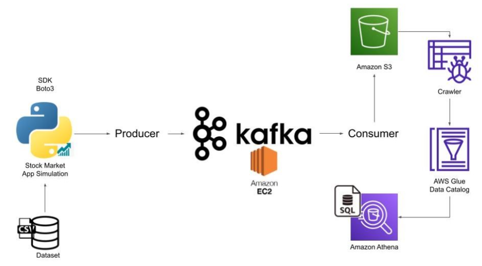

# 🚀 Real-Time Data Streaming & Querying on AWS

This project demonstrates a **real-time data streaming and querying pipeline** using:

- **Apache Kafka + Zookeeper** for streaming
- **AWS EC2** for infrastructure
- **AWS S3** for data sink
- **AWS Glue Crawler + Athena** for querying data

📍 **Conducted during the UTD x AWS Workshop 2024**

---

## 📌 Architecture

```plaintext
 [SDK] --> [Producer] --> [Kafka Producer] --> [Kafka Broker (EC2)] --> [Kafka Consumer] --> [S3 Bucket]
   |                                                                                             |
[Dataset]                                                                                  [Glue Crawler] --> [Athena]
```



